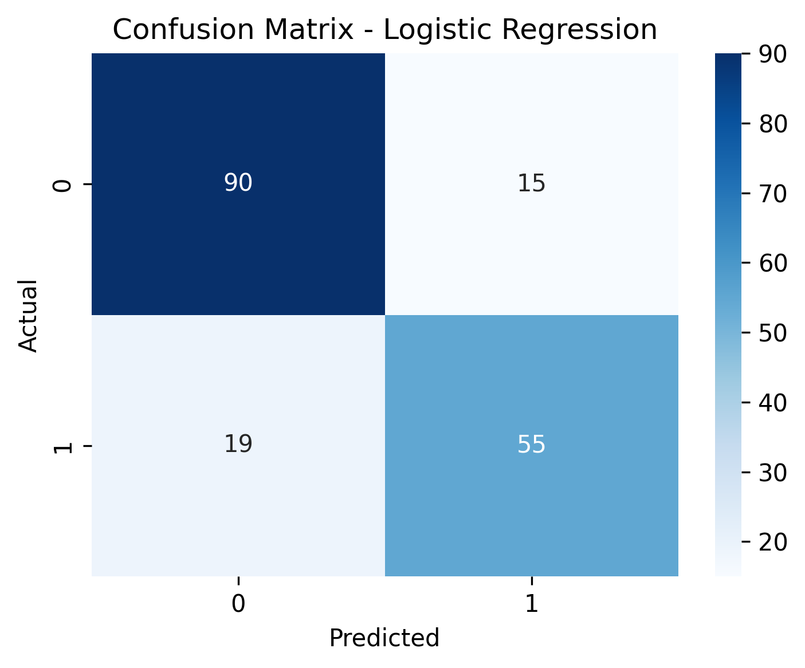
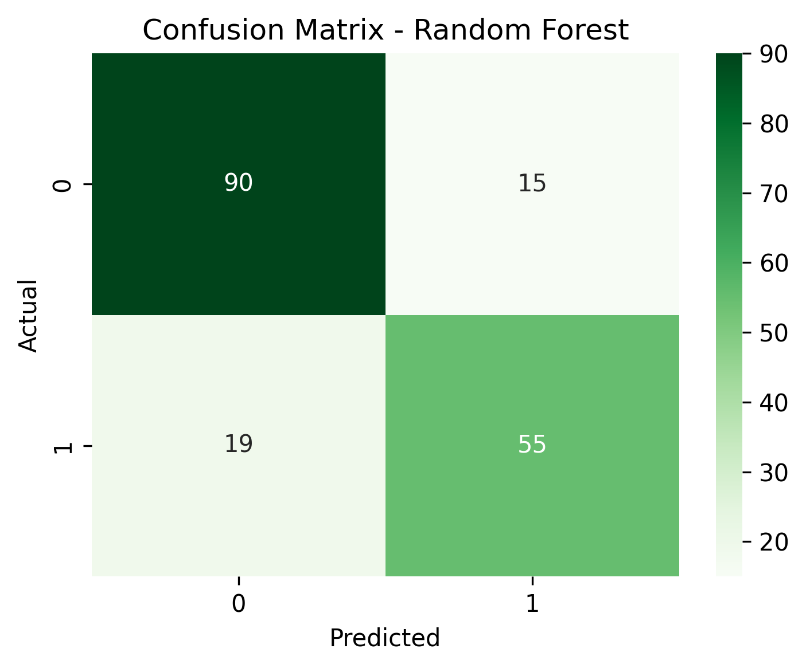

# Titanic-ML-Survival-Prediction

A Machine Learning project that predicts whether a passenger would survive the **Titanic disaster** using passenger information such as age, sex, passenger class, fare, and embarkation port.

The project uses the **Titanic dataset from Kaggle** and compares two classification algorithms: **Logistic Regression** and **Random Forest**.

---

## 📌 Project Overview

The goal of this project is to build a Machine Learning model capable of predicting passenger survival based on historical Titanic passenger data.

The project covers a complete basic Machine Learning workflow:

* Loading and exploring the dataset
* Removing unnecessary features
* Handling missing values
* Encoding categorical variables
* Splitting the data into training and validation sets
* Training multiple classification models
* Evaluating model performance
* Visualizing predictions using confusion matrices
* Generating predictions for the Kaggle test dataset

---

## 🎯 Objective

The main objective is to predict the `Survived` target variable:

| Value | Meaning         |
| ----- | --------------- |
| `0`   | Did not survive |
| `1`   | Survived        |

The project also compares the performance of **Logistic Regression** and **Random Forest** to understand how different classification approaches perform on the same dataset.

---

## 📊 Dataset

The dataset is based on the **Titanic dataset available on Kaggle**.

It contains information about Titanic passengers, including:

* Passenger ID
* Passenger class
* Name
* Sex
* Age
* Number of siblings/spouses aboard
* Number of parents/children aboard
* Ticket
* Fare
* Cabin
* Port of embarkation
* Survival status

### Dataset Files

```text
data/
├── train.csv
├── test.csv
├── gender_submission.csv
└── submission.csv
```

* **`train.csv`** — Training dataset containing passenger information and the `Survived` target.
* **`test.csv`** — Test dataset used to generate final survival predictions.
* **`gender_submission.csv`** — Sample submission provided with the Kaggle Titanic dataset.
* **`submission.csv`** — Predictions generated by the Random Forest model.

---

## 🛠️ Technologies Used

* **Python**
* **Pandas** — Data loading and preprocessing
* **Matplotlib** — Data visualization
* **Seaborn** — Confusion matrix visualization
* **Scikit-learn** — Machine Learning models and evaluation

---

## 🔄 Machine Learning Workflow

```text
Titanic Dataset
       │
       ▼
Data Loading
       │
       ▼
Remove Unused Features
       │
       ▼
Handle Missing Values
       │
       ▼
Encode Categorical Features
       │
       ▼
Train / Validation Split
       │
       ├───────────────┐
       ▼               ▼
Logistic Regression  Random Forest
       │               │
       ▼               ▼
Predictions         Predictions
       │               │
       └───────┬───────┘
               ▼
        Model Evaluation
               │
               ▼
       Confusion Matrices
               │
               ▼
      Final Test Predictions
               │
               ▼
        submission.csv
```

---

## 🧹 Data Preprocessing

Several preprocessing steps were performed before training the models.

### 1. Removing Unused Columns

The following columns were removed:

```text
PassengerId
Name
Ticket
Cabin
```

These columns were excluded to simplify the feature set and focus on useful passenger characteristics.

### 2. Handling Missing Values

Missing values in `Age` were replaced using the median age.

Missing values in `Embarked` were replaced using the most frequent embarkation port.

For the test dataset, missing `Age` and `Fare` values were also handled using training-data statistics.

### 3. Encoding Categorical Variables

The `Sex` column was converted into numerical values:

```text
male   → 1
female → 0
```

The `Embarked` column was converted using one-hot encoding.

---

## 🤖 Machine Learning Models

### Logistic Regression

Logistic Regression was used as a baseline classification model.

```python
LogisticRegression(max_iter=500)
```

It predicts the probability of a passenger belonging to either the survived or non-survived class.

### Random Forest

A Random Forest classifier was also trained:

```python
RandomForestClassifier(
    n_estimators=100,
    random_state=42
)
```

The Random Forest model combines multiple decision trees to make predictions and can capture more complex relationships between the input features.

---

## 📈 Model Evaluation

The dataset was divided into training and validation sets using an **80/20 split**.

The models were evaluated using:

* Accuracy
* Precision
* Recall
* F1-score
* Confusion Matrix

The script prints the classification report and accuracy for both models directly in the terminal.

---

## 📊 Confusion Matrices

The confusion matrices below show the classification performance of the two models on the validation dataset.

<table>
  <tr>
    <td align="center">
      <strong>Logistic Regression</strong><br><br>
      
    </td>
    <td align="center">
      <strong>Random Forest</strong><br><br>
      
    </td>
  </tr>
</table>


## 📁 Project Structure

```text
Titanic-ML-Survival-Prediction/
│
├── README.md
├── titanic_ml.py
├── requirements.txt
├── .gitignore
│
├── data/
│   ├── train.csv
│   ├── test.csv
│   ├── gender_submission.csv
│   └── submission.csv
│
└── images/
    ├── logistic_regression_confusion_matrix.png
    └── random_forest_confusion_matrix.png
```

---

## ▶️ How to Run

### 1. Clone the repository

```bash
git clone https://github.com/YOUR-USERNAME/Titanic-ML-Survival-Prediction.git
```

### 2. Navigate to the project

```bash
cd Titanic-ML-Survival-Prediction
```

### 3. Install dependencies

```bash
pip install -r requirements.txt
```

Or:

```bash
pip install pandas matplotlib seaborn scikit-learn
```

### 4. Run the Machine Learning script

```bash
python titanic_ml.py
```

The script will:

1. Load the training dataset.
2. Preprocess the data.
3. Train Logistic Regression.
4. Train Random Forest.
5. Evaluate both models.
6. Generate confusion matrices.
7. Save the graphs inside the `images/` directory.
8. Generate predictions for the test dataset.
9. Save the final predictions as `data/submission.csv`.

---

## 📄 Output

After running the program, the following files are generated/updated:

```text
images/
├── logistic_regression_confusion_matrix.png
└── random_forest_confusion_matrix.png

data/
└── submission.csv
```

The `submission.csv` file contains:

```text
PassengerId
Survived
```

and can be used as a prediction submission file for the Kaggle Titanic competition.

---

## 💡 Key Learning Outcomes

Through this project, I gained practical experience with:

* Data preprocessing
* Handling missing data
* Feature selection
* Categorical variable encoding
* Train-validation splitting
* Binary classification
* Logistic Regression
* Random Forest
* Model evaluation
* Confusion matrices
* Generating predictions from unseen data
* Working with Kaggle datasets

---

## 🚀 Future Improvements

Possible improvements to this project include:

* Performing more detailed Exploratory Data Analysis (EDA)
* Creating additional visualizations
* Feature engineering from existing passenger information
* Comparing additional Machine Learning algorithms
* Performing hyperparameter tuning
* Using cross-validation
* Improving the preprocessing pipeline with Scikit-learn pipelines
* Comparing validation performance across multiple models

---

## 📚 Dataset Source

Dataset: **Titanic - Machine Learning from Disaster**

Source: Kaggle

The project uses the publicly available Titanic dataset provided for the Kaggle competition.

---

## 👨‍💻 Author

**Jayartha Sengupta**

This project was developed as part of my Machine Learning and data science project work, with the goal of gaining practical experience in building and evaluating classification models.
